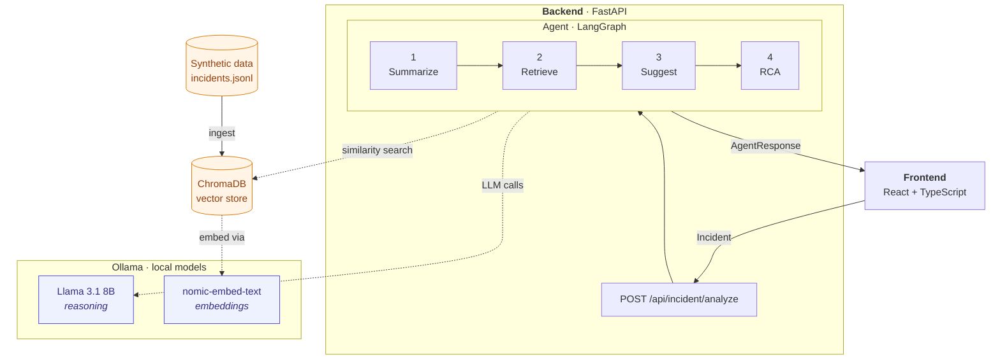

# Incident Management AI Copilot

A local-first AI copilot that helps support engineers resolve incidents faster. Paste a ticket, get a summary, similar past incidents, suggested resolution steps, and a structured RCA — all running on free, local models.

Built for the TCS AI Friday hackathon, May 2026.

## Architecture



> **On the diagram:** this is rendered with Mermaid (built-in to GitHub). If the team prefers Excalidraw, draw the diagram at <https://excalidraw.com>, export as PNG with embedded scene, save to `docs/architecture.excalidraw.png`, and replace the Mermaid block above with ``. The `.png` is re-editable in Excalidraw.

## Repo layout

```
.
├── README.md                <- you are here
├── docs/
│   └── architecture.md      <- detailed architecture, schemas, REST contract
├── frontend/                <- React + TypeScript
└── backend/
    ├── requirements.txt
    ├── shared/              <- Pydantic schemas — the cross-team contract
    ├── data_gen/            <- synthetic incident generator
    ├── vectorstore/         <- ChromaDB ingest + retrieval
    ├── agent/               <- LangGraph state machine
    └── api/                 <- FastAPI app
```

Each folder has its own `README.md` describing what it's for and the contract it must honor.

## Quickstart

**Prerequisites** (install once per laptop, ~10 minutes including downloads):

```bash
# 1. Install Ollama: https://ollama.com/download
# 2. Pull the two models we use
ollama pull llama3.1:8b
ollama pull nomic-embed-text
# 3. Verify
ollama run llama3.1:8b "say hi in one word"
```

**Run the backend:**

```bash
cd backend
python -m venv .venv && source .venv/bin/activate    # Windows: .venv\Scripts\activate
pip install -r requirements.txt
uvicorn api.main:app --reload --port 8000
```

Then visit <http://localhost:8000/docs> — auto-generated OpenAPI playground.

Smoke test (in a second terminal, from the `backend/` directory):

```bash
curl http://localhost:8000/api/health
# {"status":"ok"}

curl -X POST http://localhost:8000/api/incident/analyze \
  -H "Content-Type: application/json" \
  --data-binary @api/sample_request.json
# returns a mocked AgentResponse until the real agent is wired in
```

**Run the frontend:** see [`frontend/README.md`](./frontend/README.md).

## How we work

The repo is laid out so that each folder under `backend/` and the `frontend/` folder owns one piece of the system, with `backend/shared/schemas.py` acting as the cross-cutting contract everything else imports.

The mock API endpoint is wired up from day one, so the frontend can render real-shaped responses immediately and the agent can be developed against it. As real components come online, they replace the mock piece by piece. Schema changes ripple through the whole codebase, so they're worth agreeing on as a group before merging.

For the design rationale and the cross-team contract, see [`docs/architecture.md`](./docs/architecture.md).
